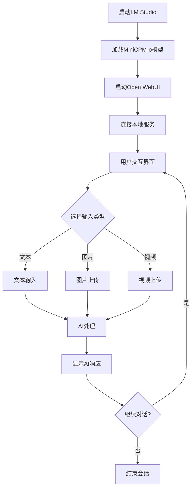

## 1. 产品概述
Ling是一款基于MiniCPM-o 4.5模型的本地AI助手，专为注重隐私的用户设计。用户可以通过文本、图片和视频与AI进行交互，所有处理都在本地完成，确保数据安全和隐私保护。

目标用户：需要AI助手功能但关注数据隐私的个人用户，以及希望在本地环境中使用多模态AI的开发者和技术爱好者。

## 2. 核心功能

### 2.1 用户角色
| 角色 | 注册方式 | 核心权限 |
|------|----------|----------|
| 本地用户 | 无需注册，本地使用 | 完整使用所有AI功能，包括文本、图像、视频交互 |

### 2.2 功能模块
Ling本地AI助手包含以下核心功能：
1. **多模态交互界面**：支持文本输入、图片上传、视频输入的交互界面
2. **AI对话处理**：基于MiniCPM-o 4.5模型的智能对话和推理
3. **媒体处理**：图片和视频的分析与理解能力
4. **本地服务管理**：LM Studio服务器状态监控和管理

### 2.3 页面详情
| 页面名称 | 模块名称 | 功能描述 |
|-----------|-------------|-------------|
| 主交互界面 | 对话输入区 | 支持文本输入、图片拖拽上传、视频文件选择 |
| 主交互界面 | 消息展示区 | 显示用户消息和AI回复，支持图片和视频预览 |
| 主交互界面 | 模型状态指示 | 显示MiniCPM-o模型加载状态和服务连接状态 |
| 设置页面 | 模型配置 | 配置LM Studio连接参数，模型选择 |
| 设置页面 | 输入设置 | 设置图片和视频的最大文件大小限制 |
| 历史记录 | 对话历史 | 本地保存的对话记录，支持搜索和删除 |

## 3. 核心流程
用户操作流程：
1. 启动LM Studio并加载MiniCPM-o 4.5模型
2. 通过Open WebUI连接本地LM Studio服务
3. 在交互界面输入文本、上传图片或视频
4. AI处理输入并返回多模态响应
5. 用户可以查看、保存或继续对话

## 4. 用户界面设计

### 4.1 设计风格
- **主色调**：深灰色(#2D3748)和蓝色(#4299E1)的科技感配色
- **按钮样式**：圆角矩形，悬停效果，现代化扁平设计
- **字体**：系统默认字体，确保可读性
- **布局风格**：侧边栏+主内容区的现代化布局
- **图标风格**：使用简洁的线性图标，支持拖拽上传的视觉反馈

### 4.2 页面设计概述
| 页面名称 | 模块名称 | UI元素 |
|-----------|-------------|-------------|
| 主交互界面 | 对话输入区 | 底部固定输入框，支持多行文本，拖拽区域高亮显示 |
| 主交互界面 | 消息展示区 | 聊天气泡样式，用户消息右对齐，AI消息左对齐，支持媒体预览 |
| 主交互界面 | 模型状态指示 | 顶部状态栏显示连接状态，绿色表示正常，红色表示断开 |
| 设置页面 | 模型配置 | 表单输入LM Studio地址和端口，测试连接按钮 |
| 历史记录 | 对话列表 | 左侧边栏显示历史对话，支持搜索和按时间排序 |

### 4.3 响应式设计
采用桌面优先设计，主要面向PC端用户。界面支持窗口大小调整，确保在不同分辨率下的良好体验。

### 4.4 本地部署特性
- 完全离线运行，无需互联网连接
- 支持本地文件处理，不上传用户数据
- 提供模型加载进度和内存使用监控
- 支持多语言界面切换

## 5. 未来路线图

### 5.1 桌面客户端开发计划
**目标**：开发专属的 Ling 桌面客户端，使用 Tauri + React/Rust 技术栈

**开发动机**：
- 提供更轻量级、高度可定制的原生应用体验
- 跨平台支持（Windows、macOS、Linux）
- 相比 Docker-based WebUI 解决方案具有更好的性能和用户体验
- 长期目标是替代现有的基于 WebUI 的方案

**技术选型理由**：
- **Tauri**：提供 Rust 后端和 Web 前端的混合开发框架，体积小、性能高、安全性好
- **React**：利用现有的 Web 技术栈，便于开发和维护
- **Rust**：系统级编程语言，适合处理底层文件操作、系统调用和高性能计算

**预期优势**：
- 原生应用体验，响应更快
- 更小的安装包体积（相比 Electron 方案）
- 更好的系统集成（文件系统、通知、快捷键等）
- 更低的内存占用和 CPU 使用率
- 支持离线运行，无需浏览器环境

**开发阶段规划**：
1. **第一阶段**：基础框架搭建，实现核心聊天功能
2. **第二阶段**：集成媒体处理功能（图片、视频）
3. **第三阶段**：优化用户体验，添加高级功能（快捷键、主题等）
4. **第四阶段**：性能优化和跨平台适配

**长期愿景**：
成为 Ling 项目的主要用户界面，为用户提供专业、高效的本地 AI 助手体验。