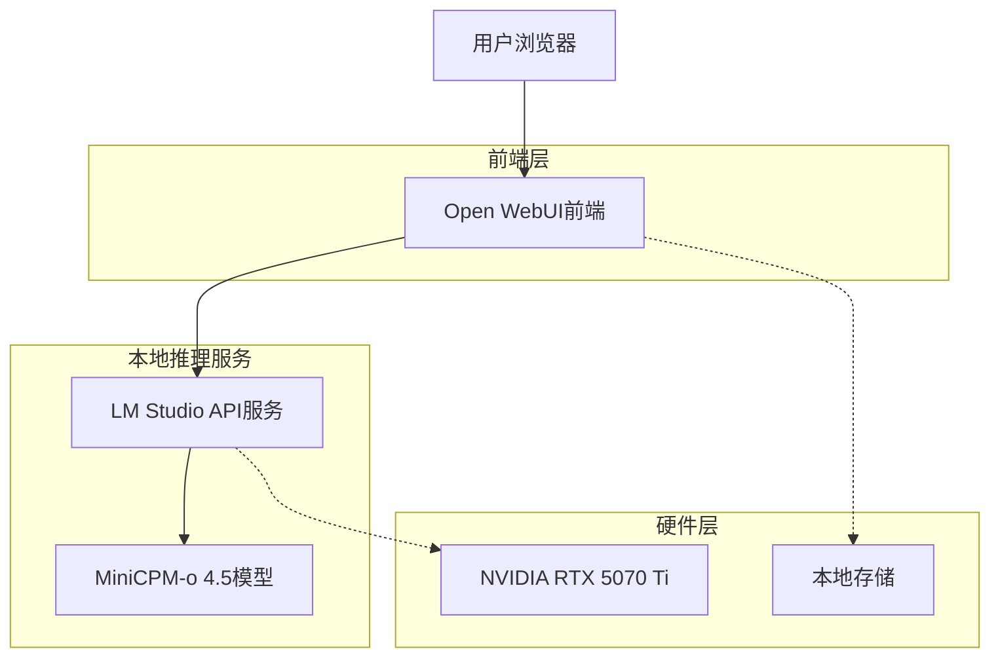
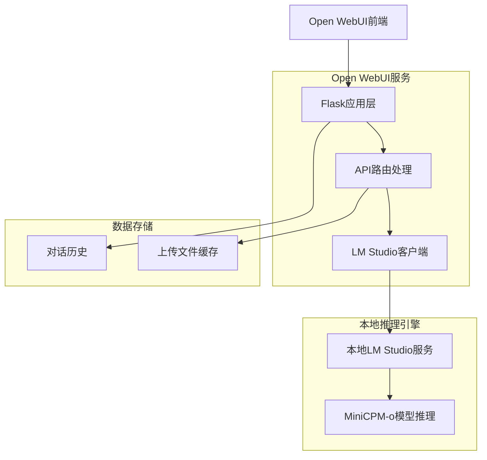
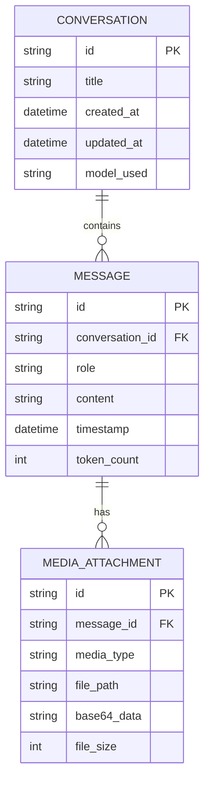

## 1. 架构设计



## 2. 技术描述

- **前端**: Open WebUI (基于Python Flask + React)
- **后端推理**: LM Studio (本地OpenAI兼容API服务)
- **AI模型**: MiniCPM-o 4.5 (多模态大语言模型)
- **部署方式**: Docker容器化部署
- **硬件加速**: NVIDIA RTX 5070 Ti (16GB显存)

## 3. 路由定义

| 路由 | 用途 |
|-------|---------|
| / | 主交互界面，多模态对话页面 |
| /settings | 设置页面，配置LM Studio连接 |
| /history | 历史记录页面，查看过往对话 |
| /api/chat | API端点，处理对话请求 |
| /api/upload | 文件上传端点，处理图片和视频 |

## 4. API定义

### 4.1 核心API

对话处理API
```
POST /api/chat
```

请求参数:
| 参数名 | 参数类型 | 是否必需 | 描述 |
|-----------|-------------|-------------|-------------|
| message | string | true | 用户输入的文本消息 |
| images | array | false | Base64编码的图片数组 |
| video | string | false | 视频文件路径 |
| model | string | true | 使用的模型名称 |

响应参数:
| 参数名 | 参数类型 | 描述 |
|-----------|-------------|-------------|
| response | string | AI的文本回复 |
| tokens_used | number | 使用的token数量 |
| processing_time | number | 处理时间(毫秒) |

示例:
```json
{
  "message": "这张图片里有什么？",
  "images": ["base64_encoded_image_data"],
  "model": "MiniCPM-o 4.5"
}
```

## 5. 服务架构图



## 6. 数据模型

### 6.1 数据模型定义



### 6.2 数据定义语言

对话表 (conversations)
```sql
-- 创建对话表
CREATE TABLE conversations (
    id TEXT PRIMARY KEY,
    title TEXT NOT NULL,
    created_at TIMESTAMP DEFAULT CURRENT_TIMESTAMP,
    updated_at TIMESTAMP DEFAULT CURRENT_TIMESTAMP,
    model_used TEXT DEFAULT 'MiniCPM-o 4.5'
);

-- 创建消息表
CREATE TABLE messages (
    id TEXT PRIMARY KEY,
    conversation_id TEXT NOT NULL,
    role TEXT NOT NULL CHECK (role IN ('user', 'assistant')),
    content TEXT NOT NULL,
    timestamp TIMESTAMP DEFAULT CURRENT_TIMESTAMP,
    token_count INTEGER DEFAULT 0,
    FOREIGN KEY (conversation_id) REFERENCES conversations(id) ON DELETE CASCADE
);

-- 创建媒体附件表
CREATE TABLE media_attachments (
    id TEXT PRIMARY KEY,
    message_id TEXT NOT NULL,
    media_type TEXT NOT NULL CHECK (media_type IN ('image', 'video')),
    file_path TEXT,
    base64_data TEXT,
    file_size INTEGER,
    FOREIGN KEY (message_id) REFERENCES messages(id) ON DELETE CASCADE
);

-- 创建索引
CREATE INDEX idx_messages_conversation_id ON messages(conversation_id);
CREATE INDEX idx_messages_timestamp ON messages(timestamp);
CREATE INDEX idx_media_attachments_message_id ON media_attachments(message_id);
```

## 7. 部署配置

### 7.1 Docker配置

Open WebUI Docker容器配置:
```yaml
version: '3.8'
services:
  open-webui:
    image: ghcr.io/open-webui/open-webui:main
    ports:
      - "8080:8080"
    environment:
      - OPENAI_API_KEY=sk-local
      - OPENAI_API_BASE_URL=http://host.docker.internal:1234/v1
    volumes:
      - ./data:/app/backend/data
    extra_hosts:
      - "host.docker.internal:host-gateway"
```

### 7.2 LM Studio配置

- 模型: MiniCPM-o 4.5
- API端口: 1234
- 上下文长度: 32768 tokens
- GPU加速: NVIDIA RTX 5070 Ti
- 批处理大小: 根据显存自动调整

## 8. 性能优化

- 使用GPU加速进行模型推理
- 实现流式响应，提升用户体验
- 本地缓存常用模型和数据
- 支持并发请求处理
- 内存使用监控和优化